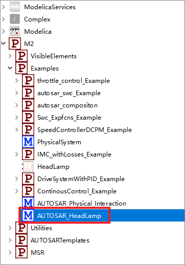
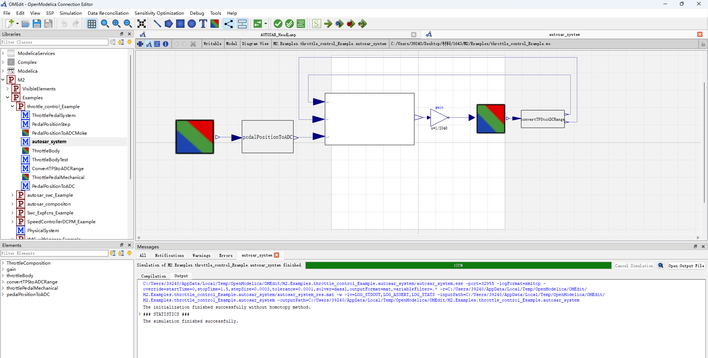
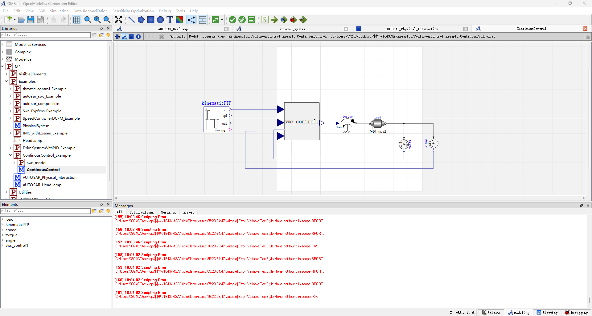

# Example Models Overview

This document provides detailed descriptions and key information for the 6 example models included in the `Examples` folder.

>✅ Validation Update: To address AE Review Comment #3 (Missing Expected Results / Output Validation), this example now includes 2–3 key simulation validation points. These highlight expected behaviors, numerical trends, and cross-tool consistency, ensuring reproducibility and correctness.

---

> 📘 **Application Note**  
> The [Automotive Throttle Control System](#2-automotive-throttle-control-system) is the **largest-scale example**, featuring **179 variables** and **451 parameters**.  
> It fully demonstrates hierarchical conversion and advanced signal handling across subsystems.

For each example, we provide a **Location** field indicating the relative path to the model files. For example, the path for the *AUTOSAR HeadLamp* system is:
`
M2/Examples/AUTOSAR_HeadLamp
`

The folder structure is illustrated below:

  

---

## Cross-Domain Modeling and Reproducibility

This artifact includes **six representative cross-domain modeling examples**, which can be executed using:

- **MWORKS Sysplorer** (recommended for full feature support)  
- **OpenModelica** (open-source alternative)

Our paper's experiments were originally conducted using Sysplorer. However, since Sysplorer may not be freely available outside of China, we have also **reproduced all experiments using OpenModelica**. The simulation results were **identical**, confirming the correctness and consistency of the models.

> 💡 **Note**: As a commercial tool, Sysplorer benefits from proprietary solver technology, typically offering **faster, more stable, and more accurate simulations** compared to open-source alternatives.

## Multi-domain Demonstration Cases(6)

### 1. Multi-Domain Modeling of Swc_Expfcns and Headlamp
#### **Description**
 All three RPort inputs are set to 0. PPort 1 and PPort 3 are connected to the switch states of "headlamp left" and "headlamp right," respectively, indicating whether the headlights are ON or OFF. PPort 4 represents the applied voltage and is linked to both "headlamp left" and "headlamp right" to simulate the electrical behavior of the lighting system.
 The HeadLamp model has two input ports: switch, controlling the ON/OFF state, and voltageInput, representing the applied voltage. The model calculates the voltage based on the switch state, then uses Ohm’s law to determine the current. Power is computed as the product of voltage and current. Brightness is derived by normalizing the power against its maximum value, ensuring it remains within [0,1].

#### **Location**
 `M2/Examples/AUTOSAR_HeadLamp`  

#### **Modelica**  

  MWORKS Sysplorer Model structure:  
    
  MWORKS Sysplorer Simulation results:  
  

  OpenModelica Model structure:  
    
  OpenModelica Simulation results:
    

#### ✅ Validation Points
- The simulation runs for 20 seconds with 500 time steps, as configured in the paper's Fig. 8.
- Left and right headlamp brightness signals alternate on and off every second, perfectly overlapping as shown in the simulation screenshots (Fig. 9 in the paper).
- The brightness exhibits a "breathing light" pattern, gradually increasing then decreasing with a 1-second delay, matching the expected physical behavior.
- Simulation results from both MWORKS Sysplorer and OpenModelica are consistent, confirming cross-tool reproducibility.
- These results validate the model’s ability to accurately replicate AUTOSAR-based headlamp control combined with physical domain interactions, demonstrating the effectiveness of the non-causal modeling approach for multi-domain systems.

### 2. Automotive Throttle Control System

#### **Description** 
A complex throttle control system with 179 variables and 451 parameters.

The Modelica model autosar_system is built on AUTOSAR architecture principles to simulate an electronic throttle system, covering the full process from driver pedal input to throttle opening response. It integrates multiple functional modules including mechanical pedal response, signal acquisition and conversion, ECU signal processing logic, and final actuator control, fully replicating the electronic throttle operation.

The physical start point is the ThrottlePedalMechanical module. It simulates the driver’s foot force as a periodic signal (footForceSignal) and contains mechanical elements such as springs, dampers, and masses to realistically model the pedal displacement under external force. The output is the pedal's mechanical displacement, reflecting the driver’s pedal depth.

This displacement is converted to an analog voltage signal by the PedalPositionToADC module, simulating the ADC acquisition in a real vehicle. The converted signal feeds into the AUTOSAR software component composition autosar_composition through interface APP_HwIO_Value. Within it, the APP_Snsr component processes the signal and generates the throttle command ThrCmd_HwIO_Value.

The throttle command passes through a normalization gain block (gain = 1/2048) and is sent to the ThrottleBody module, which drives the throttle actuator and adjusts the throttle opening.

The actual throttle opening is fed back via ConvertTPStoADCRange to produce two ADC outputs (TPS1 and TPS2), simulating redundant throttle position sensors. These signals are inputs to TPS_Primary and TPS_Secondary software components in autosar_composition, simulating ECU’s real-time throttle position monitoring and forming a closed-loop control system.

autosar_composition is the core control module integrating the pedal sensor unit (APP_Snsr), actuator control unit (Actuator), and dual throttle position feedback units (TPS_Primary and TPS_Secondary). The components connect via standard signal ports, following typical AUTOSAR software component communication patterns. Each component encapsulates specific logic such as lookup tables and control algorithms, mimicking embedded software behavior.

The model design decouples physical and control modeling: mechanical structures describe dynamic pedal and throttle responses, while AUTOSAR software components modularly organize control logic, supporting signal acquisition, data processing, and execution control. This enables controller design verification, embedded software function testing, and multi-domain co-simulation.

Simulation assumes a 60N force applied to the pedal over 0–1 seconds. The pedal displacement, converted into voltage, is processed by the AUTOSAR controller to generate throttle commands that control throttle actuator motion. Throttle displacement feedback closes the loop. Results show a maximum pedal displacement of about 15 cm under 60N load. Throttle opening closely follows pedal input dynamics, validating the model's accuracy.

#### **Location**
 `M2/Examples/throttle_control_Example/autosar_system`  

#### **Modelica**  
  MWORKS Sysplorer Model structure: 
    
  ThrottlePedalMechanical:
  
  MWORKS Sysplorer Simulation results:  
  
  OpenModelica Model structure:  
    
  OpenModelica Simulation results:
    

#### ✅ Validation Points
- A 60N pedal force applied from 0 to 1 second results in a **maximum pedal displacement of approximately 15 cm**, as shown in the simulation screenshot.

- The throttle opening signal follows the pedal displacement trend with minimal delay, showing a realistic actuator response and correct signal propagation through the AUTOSAR software stack.

- The feedback signals TPS1 and TPS2 display a consistent trajectory closely matching the throttle opening, demonstrating functional redundancy and correct feedback loop operation.

- Simulation results from both MWORKS Sysplorer and OpenModelica show consistent trends and behaviors, validating model portability and cross-platform correctness.

### 3. AUTOSAR_Physical_Interacction
#### **Description**
This model, named AUTOSAR_Physical_Interaction, represents a typical closed-loop control system combining software control components with physical system dynamics. It comprises three parts: an AUTOSAR software component model (autosar_swc), a physical system model (PhysicalSystem), and their interconnection logic.

The PhysicalSystem model is a simplified second-order mechanical system with mass, damping, and spring elements. It receives two external control force inputs from the software components and applies Newton’s second law to compute acceleration as the net force divided by mass. The outputs are position and velocity signals fed back to the controller.

The software component model uses the autosar_swc_Example case.

At the top-level, the two subsystems form a closed-loop: physical displacement and velocity feed into the software component’s inputs, while the software outputs two control forces that act on the physical system. This implements a "sense–decide–act–feedback" closed-loop control logic.
#### **Location**
 `M2/Examples/AUTOSAR_Physical_Interacction`
#### **Modelica**  

  MWORKS Sysplorer Simulation results:  
  

  OpenModelica Simulation results:
   

#### ✅ Validation Points
- Position (phys.x) and velocity (phys.v) signals smoothly increase starting from 1 second, reflecting expected second-order mechanical system dynamics.

- The closed-loop control logic is effectively realized: software component outputs control forces that act on the physical system, while phys.x (displacement) and phys.v (velocity) feed back into the controller as inputs. These feedback signals reinforce the control output direction, demonstrating a positive feedback pattern that drives the system response forward.

- Simulation results from both MWORKS Sysplorer and OpenModelica are consistent, validating cross-tool correctness and reproducibility.

### 4. ContinousControl_Example
#### **Description**
The ContinuousControl Modelica model simulates a controller-based rotational system, where multiple functional modules cooperate to achieve continuous control of the load's angular displacement. The reference trajectory is generated by the KinematicPTP2 block, which outputs a smooth desired angle trajectory (final value π radians) with specified velocity and acceleration limits, providing reference input to the control system.

The core control logic is implemented by swc_control1, reflecting the AUTOSAR software component (SWC) concept. In AUTOSAR, an SWC is a fundamental functional unit containing runnable entities triggered under specific conditions. This control SWC divides into fast and slow control parts internally, handling speed and angle feedback respectively, generating torque output signals for a dual-loop control strategy. This modeling approach simulates both control algorithm logic and AUTOSAR software architecture design.

The control torque output drives the rotational inertia (Inertia module), simulating the controlled load’s dynamic response. Speed and angle sensors provide real-time feedback to close the control loop.

The simulation uses the DASSL solver from 0 to 4 seconds with a step size accuracy of 1e-4 to ensure precise dynamic response capture.
#### **Location**: `M2/Examples/ContinousControl_Example/ContinousControl`
#### **Modelica**  
  MWORKS Sysplorer  Model structure:  
    
  swc_control:
   
  SlowControlRunnable:  
    
  FastControlRunnable:  
    

  MWORKS Sysplorer Simulation results:  
  

    OpenModelica Model structure:  
    
  OpenModelica Simulation results:
    

#### ✅ Validation Points
- The control torque output (torque.tau) and angular displacement (angle.phi) remain near zero throughout the 0–4 second simulation, consistent with expected system steady-state behavior.

- The dual-loop control implemented by swc_control1 effectively maintains the rotational load within the desired trajectory bounds without oscillations or instability.

- Simulation results from MWORKS Sysplorer and OpenModelica match closely, confirming cross-platform consistency and model correctness.

### 5. DriveSystemWithPID_Example
#### **Description**
A simple drive system regulated by a PID controller, modeling a motor-load setup connected via an elastic coupling, with control logic encapsulated in an AUTOSAR application layer component. Key modules include reference trajectory generation, PI controller, motor inertia, load inertia, spring-damper, and sensors.

System composition and working principle:
The reference trajectory is generated by the Modelica.Blocks.Sources.KinematicPTP block, which sets the target angular position from rest at 0 seconds to a defined angle (driveAngle, default π/2) with specified acceleration and velocity after 0.5 seconds.

The controller is encapsulated within an AUTOSAR software component swc_model.swc, containing a Runnable_PID runnable entity composed of:

An integrator converting reference angle to desired velocity.

A PI controller implemented with Modelica.Blocks.Continuous.LimPID, supporting anti-windup and initial steady-state settings, outputting control torque.

Two input ports receiving reference angle and actual speed, with output torque through a PPORT.

Actuator and transmission:
The controller output torque drives the motor inertia (inertia1). The motor transmits motion to the load inertia (inertia2) through an elastic spring-damper connection. A constant load torque disturbance (10 Nm) is applied via loadTorque.

Sensor feedback:
A SpeedSensor measures motor-side angular velocity and feeds back to the PID controller for closed-loop control.

#### **Location**
`M2/Examples/DriveSystemWithPID_Example/driveSystemWithPID`

#### **Modelica**  
  
  Model structure:  
    

 DriveSystemWithPID_swc:
  

Runnable_PID:
 

  Simulation results:  
  

  OpenModelica Model structure:  
    
  OpenModelica Simulation results:
    

#### ✅ Validation Points
- The simulated response confirms that the AUTOSAR-integrated PID controller effectively regulates the drive system's motion in response to the reference position command.

- The motor-side angular velocity (swc1.u1) rises as expected following the KinematicPTP trajectory, then stabilizes as the target is approached. The velocity changes reflect the acceleration and deceleration phases defined by the motion profile.

- The control torque output (swc1.pport) exhibits piecewise constant values and quick adjustments, typical of a PI-controlled loop compensating for load disturbance and inertial mismatch.

- The controller reference input (swc1.u) and the motor inertia (inertia1.J) behave as expected in a closed-loop system, with the motor's inertia influencing the transient response but remaining constant during the simulation.

- Simulation results are consistent across both Sysplorer and OpenModelica, indicating portability and correctness of the AUTOSAR-based control architecture and its functional behavior.

### 6. IMC_withLosses_Example

#### **Description**:  
This model represents the electrical and mechanical characteristics of a three-phase asynchronous squirrel-cage induction motor. It not only captures the physical performance parameters of the motor but also emphasizes the controller part implemented as AUTOSAR-based software components (SWC).

The motor’s rated parameters such as rated power, rated voltage, current, power factor, efficiency, rated speed, and rated torque are defined. Measurement data tables are used to model and validate the motor’s current, power, speed, power factor, and efficiency characteristics.

The motor subsystem utilizes Modelica’s built-in squirrel-cage induction motor module (`IM_SquirrelCage`), parameterized with motor data including stator resistance, inductance, rotor parameters, mechanical inertia, and friction losses to accurately represent the motor’s electromechanical dynamic behavior.

On the electrical side, the model includes three-phase voltage sources, star connection, power and current sensors to simulate and measure the electrical input and output characteristics. The mechanical side consists of torque sources, inertia, and power sensors describing the mechanical load and speed response of the motor.

#### **Location**: `M2/Examples/IMC_withLosses_Example/IMC`

#### **Modelica**  
  Model structure:  
    

  SWC:  
    

  Runnable:  
    

  Simulation results:  
  

  OpenModelica Model structure:  
    
  OpenModelica Simulation results:
    

#### ✅ Validation Points
- The input torque demand (swc1.pport) follows a designed profile: zero torque from 0–5s, a linear ramp from 0 to 150 Nm between 5–10s, and remains constant at 150 Nm thereafter. This confirms the expected behavior of the software control input.

- The measured torque at the motor interface (powerSensorQS.flange_a.tau) precisely mirrors the input torque with an opposite sign, indicating correct force balance and torque transfer through the motor shaft.

- The tight correlation between control input and mechanical output across the entire 0–15s simulation period demonstrates correct physical-software integration and validates the fidelity of the AUTOSAR-style torque controller implementation.

---
