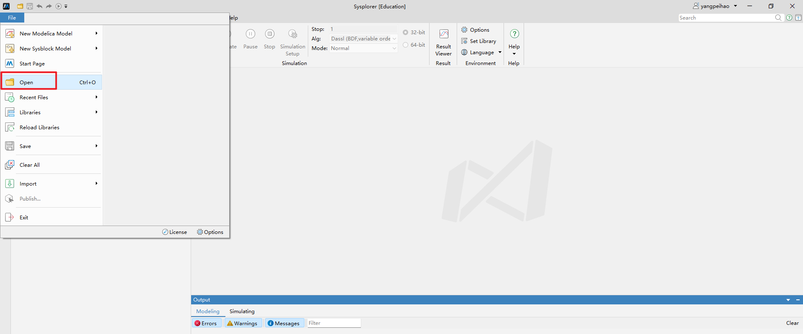
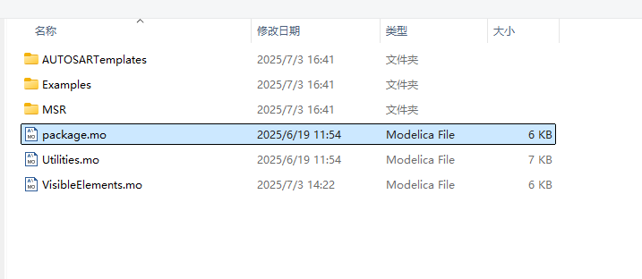
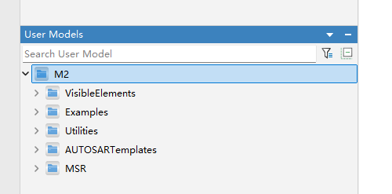
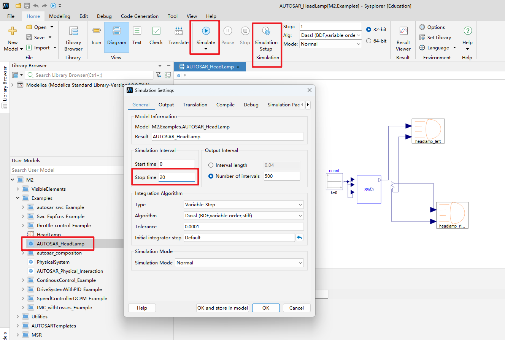
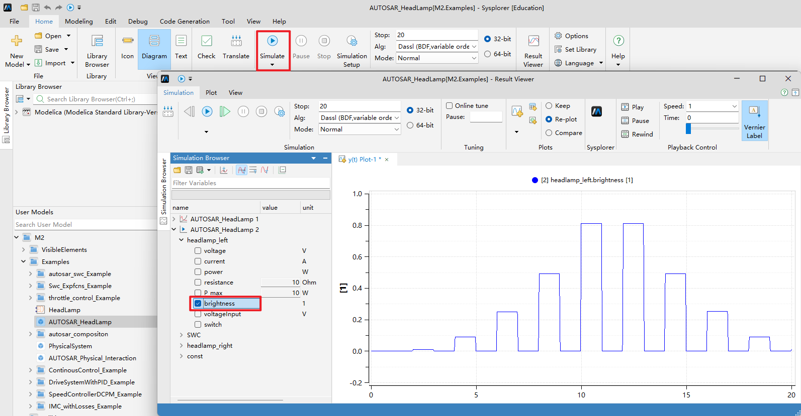
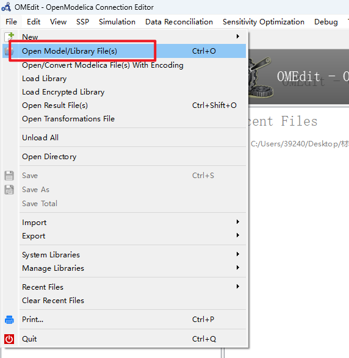
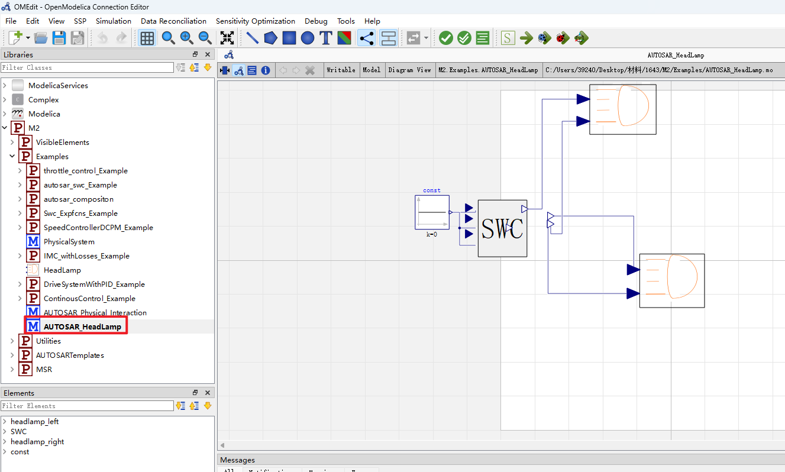
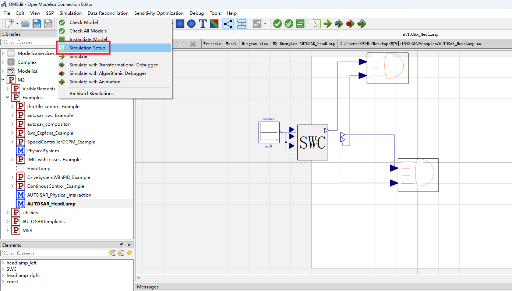
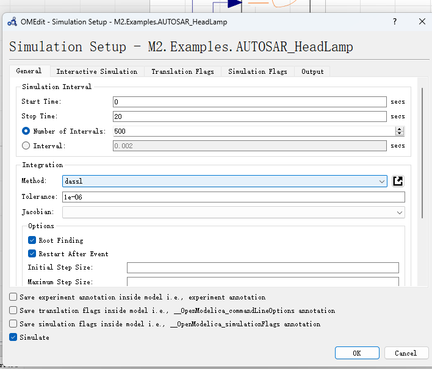
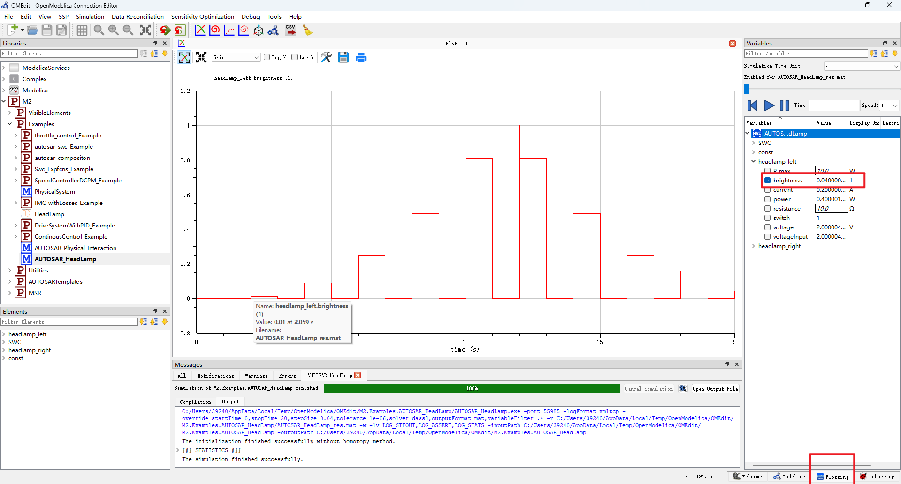

# 📦 Artifact for MODELS 2025 Submission (Paper #35)

## 📄 Paper Title  
**Visual Modeling and Simulation of AUTOSAR Application Layer Models Using Modelica**

## ✍️ Authors  
- **Peihao Yang**, Harbin Institute of Technology; Zhengzhou Research Institute, HIT  
  📧 yangpeihao@stu.hit.edu.cn  
- **Tiantian Wang**, Harbin Institute of Technology  
  📧 wangtiantian@hit.edu.cn  
- **Ming Yang**, Harbin Institute of Technology  
  📧 23S136282@stu.hit.edu.cn  
- **Xiaohong Su**, Harbin Institute of Technology  
  📧 sxh@hit.edu.cn  


---

## 📌 Quick Links

| Content                                 | Link                         |
|----------------------------------------|------------------------------|
| 🧪 Example models & simulation results | [EXAMPLES.md](./EXAMPLES.md) |
| ⚙️ System & software requirements      | [REQUIREMENTS.md](./REQUIREMENTS.md) |
| 🏅 Artifact badge justification         | [STATUS.md](./STATUS.md)     |
| 📄 Full conference paper                | [paper.pdf](./paper.pdf)     |

---

## 📚 Contents

This artifact contains:

- A **Modelica-based AUTOSAR Application Layer Modeling Library**, structured as:
```
📂 M2/ # Encapsulated AUTOSAR model library
├── 📂 VisibleElements/ # Visual modeling elements for drag-and-drop AUTOSAR SWC construction
├── 📂 Examples/ # Ten modeling examples across automotive, electrical, and mechanical domains
├── 📂 Utilities/ # Utility components and helper functions for model development
├── 📂 AUTOSAR Templates/ # Core modeling templates (e.g., GenericStructure, SWComponentTemplate) based on AUTOSAR standards
└── 📂 MSR/ # Contains class definitions for elements in the Manufacturer Supplier Relationship (MSR)
```
- [EXAMPLES.md](./EXAMPLES.md): Model descriptions, simulation results, and configuration notes  
- [REQUIREMENTS.md](./REQUIREMENTS.md): System and software requirements  
- [STATUS.md](./STATUS.md): Applied badges and justification for artifact evaluation
- `time-cost-logs/`: Screenshots capturing simulation time across platforms  
- `paper.pdf`: Original paper as accepted in MODELS 2025  
- Instructions for **reproduction** and **artifact reuse**

---


##  🔁 Correspondence Between the Paper’s Claims and Supporting Examples
The table below clarifies the correspondence between the provided models and the sections/figures in the paper. It addresses the concern that the examples lacked clear alignment with the paper’s claims and results.

| Model Path                         | File                        | Paper Section / Figure | Description                                             |
|-----------------------------------|-----------------------------|------------------------|---------------------------------------------------------|
| M2.Examples.Swc_Expfcns_Example.Swc_Expfcns | M2/Examples/Swc_Expfcns_Example.mo                  | Sec Ⅴ / Fig. 5;Sec Ⅴ /TABLE Ⅳ （Swc_Expfcns_Example）       | The main AUTOSAR SWC application layer model implemented using Modelica                    |
| M2.Examples.Swc_Expfcns_Example.Swc_Expfcns.runnable1_subsystem       | M2/Examples/Swc_Expfcns_Example.mo       | Sec Ⅴ / Fig. 6(a)       | First runnable design within the Swc_Expfcns component   |
| M2.Examples.Swc_Expfcns_Example.Swc_Expfcns.runnable2_subsystem       | M2/Examples/Swc_Expfcns_Example.mo       | Sec Ⅴ / Fig. 6(b)       | Second runnable design within the Swc_Expfcns component        |
| M2.Examples.Swc_Expfcns_Example.Swc_Expfcns.runnable3_subsystem       | M2/Examples/Swc_Expfcns_Example.mo       | Sec Ⅴ / Fig. 6(c)       | Third runnable design within the Swc_Expfcns component        |
| M2.Examples.Swc_Expfcns_Example.Swc_Expfcns.runnable1_subsystem.subsystem_EnableSubsystem       | M2/Examples/Swc_Expfcns_Example.mo  | Sec Ⅴ / Fig. 6(d)       | Subsystem logic used inside the first runnable (EnableSubsystem)     |
| M2.Examples.AUTOSAR_HeadLamp       | M2/Examples/AUTOSAR_HeadLamp.mo  | Sec Ⅴ / Fig.8       | Multi-domain headlamp system integrating AUTOSAR logic and physical model    |
| M2.Examples.throttle_control_Example.autosar_system       | M2/Examples/throttle_control_Example.mo  | Sec Ⅴ / TABLE Ⅳ(Automotive throttle control system)       | Demonstrates co-simulation of throttle control logic in AUTOSAR with mechanical model     |
| M2.Examples.autosar_swc_Example.autosar_swc       | M2/Examples/autosar_swc_Example.mo  | Sec Ⅴ / TABLE Ⅳ(autosar_swc_Example)       | AUTOSAR SWC model featuring multi-rate sampling behavior    |


> See [EXAMPLES.md](./EXAMPLES.md) for full details and additional models.
---

## 🔬 Examples

This artifact includes **6 multi-domain modeling examples**, spanning automotive, electrical, and mechanical systems.

For detailed explanations, usage guides, and results, please refer to [EXAMPLES.md](./EXAMPLES.md).  
These examples demonstrate the flexibility, extensibility, and fidelity of our proposed modeling approach.

> To ensure reproducibility, all experiments were performed using both **MWORKS Sysplorer** and **OpenModelica**, yielding consistent results.

---

## ⚙️ Installation & Usage

### ✅ Prerequisites

- **Operating System**: Windows 10 or later (64-bit)
- **Modeling Tools**: [MWORKS Sysplorer](https://www.tongyuan.cc/product/MWorksSysplorer) (recommended if available) or  [OpenModelica 1.25.1 (64-bit)](https://build.openmodelica.org/omc/builds/windows/releases/1.25/1/64bit/)
- **Modelica Standard Library**: Version 4.0.0 (bundled with most tools)

---

### ▶️ Running with MWORKS Sysplorer (Recommended)

1. Clone the repository:
 ```sh
 git clone https://github.com/YangPeihao1203/Modelica4AUTOSAR.git
 cd Modelica4AUTOSAR
```

2. **Open MWORKS Sysplorer**, and load the main model package:

   - Go to `File → Open`
   - Navigate to and select `M2.package.mo`
      
      

   After loading, the model tree should appear as follows:  
      

3. **Simulate the `AUTOSAR_HeadLamp.mo` example**:

   - Select the `AUTOSAR_HeadLamp.mo` model
   - Set the simulation time to **20 seconds**
   - Click **Run Simulation**
      
   You should see output similar to the following:  
      

4. For other examples, please refer to the model paths and descriptions provided in [EXAMPLES.md](./EXAMPLES.md).

---

### 🧪 Verifying with OpenModelica

> ⚠️ **If MWORKS Sysplorer is not available** (e.g., outside mainland China), [OpenModelica](https://openmodelica.org/) can be used as an open-source alternative. Our experiments confirm consistent simulation results between both environments.

1. **Download & Install**  
   - Get [OpenModelica 1.25.1 (64-bit)](https://build.openmodelica.org/omc/builds/windows/releases/1.25/1/64bit/)
   - During installation, ensure that the **installation path contains no spaces**

2. **Launch the OMEdit GUI**  
   - Start `OMEdit.exe` from the installed directory

3. **Load the model**  
   - Select `File → Open Model/Library File(s)`
   - Load `M2.package.mo`  
     
     

4. **Choose and run a sample model**  
   - Select one of the example models from the project
   - Set the simulation stop time to **20 seconds**  
     
     


5. **View simulation results**  
   - After the run completes, use the variable browser to inspect and plot signals  
     


### 🧩 How to Create SWCs and Runnables

In this Modelica-based AUTOSAR library, **SWCs (Software Components)** and **Runnables** are modeled as container classes.

To create them:

1. **Use `model` or `block`** to define a new class:
   ```modelica
   model MySWC
     // Define internal ports, logic, or nested components
   end MySWC;
   ```
2. Name the class to match your AUTOSAR element (e.g., BrakeControlSWC, Runnable1).

3. Compose internal structure using visual elements from VisibleElements/.

4. Use or connect SWC/Runnable in higher-level system models.

This method supports drag-and-drop modeling and is compatible with both MWORKS and OpenModelica.

---

## 📝 License

This project is released under the **AGPL License**.  
Please see the [LICENSE](./LICENSE) file for full terms and conditions.

---

## 📬 Contact

For questions, contributions, or bug reports, feel free to [open an issue](https://github.com/YangPeihao1203/Modelica4AUTOSAR/issues)  
or reach out via email:  
📧 **yangpeihao@stu.hit.edu.cn**"# Modelica4AUTOSAR_AE" 
